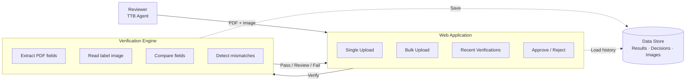

# Technical Documentation — TTB Label Verifier

This document covers the system's architecture, tools, assumptions, and planned enhancements. For setup and run instructions, see [README.md](README.md).

---

## Approach

### Problem

TTB alcohol label reviewers manually compare a submitted label image against a Label application PDF to verify that every required field matches. This is repetitive, time-consuming, and error-prone at scale (up to 500+ labels per day).

### Solution

An AI-assisted verification pipeline that:

1. **Extracts structured data from the COLA Application PDF** using `pdfplumber` (form fields + embedded text).
2. **Extracts text from the label image** using Tesseract OCR with preprocessing (grayscale conversion, adaptive thresholding) to handle low-contrast labels.
3. **Compares fields** using a mix of exact matching, tolerance-based numeric comparison, and semantic similarity (sentence-transformers) for fields where wording legitimately varies.
4. **Detects wrong-label submissions** — if the brand name similarity between PDF and image is very low, a mismatch warning is raised before field-level results are shown.
5. **Streams bulk results** in real time using Server-Sent Events (SSE), so reviewers see each label's result as soon as it completes rather than waiting for the whole batch.

Reviewers then make an Approve or Reject decision, which is stored for audit purposes.

---

## Architecture

**Request flow:**
1. Reviewer uploads a PDF and label image via the browser
2. nginx routes API calls to the FastAPI backend and serves the React frontend as static files
3. The backend runs the PDF and label image through the verification pipeline in parallel
4. Results are returned immediately (single upload) or streamed back as each label completes (bulk upload via SSE)
5. Verification results and decisions are stored in SQLite; label images are stored on a Docker volume

---

## Design Principles

| Technical Implementation |
|---|---|
| **No internet required** | All AI processing runs locally. OCR (Optical Character Recognition) uses Tesseract bundled in the Docker image. Semantic matching uses the `all-MiniLM-L6-v2` sentence-transformer model baked in at build time (`TRANSFORMERS_OFFLINE=1`). No label data is sent to external APIs at any point. |
| **Results in seconds** | Each verification completes in under 10 seconds. Bulk verifications use Server-Sent Events (SSE) via FastAPI `StreamingResponse` to stream each result to the client as soon as it completes, rather than waiting for the whole batch. |
| **Simple, accessible interface** | Navigation is limited to three entry points (Single Upload, Bulk Upload, Recent Verifications). The UI uses inline React styles with no external CSS framework, keeping the component surface minimal and predictable. |
| **Understands natural language variation** | Brand name and producer fields are compared using cosine similarity from `sentence-transformers` rather than exact string matching. This tolerates legitimate variations in capitalisation, abbreviation, and wording without falsely failing a valid label. |
| **Reads imperfect label photos** | The OCR pipeline applies image preprocessing (grayscale conversion, adaptive thresholding, contrast enhancement via Pillow and OpenCV) before passing the image to Tesseract, improving accuracy on low-contrast, angled, or wrinkled label photographs. |
| **Batch processing for high-volume days** | Bulk upload accepts any mix of PDFs and image files in a single drop. The backend parses all PDFs concurrently, pairs each with its image by ID or filename prefix, then streams verification results back to the UI as each pair completes. |
| **Flags wrong labels before field checking** | A mismatch detector runs after field comparison. If average confidence across all fields is below 0.15 with a high fail rate, or if brand name similarity is below 0.10, or if the beverage category differs entirely (e.g. wine vs. spirits), a mismatch alert is raised before field-level results are shown. |
| **Standalone and self-contained** | The full stack (frontend, backend, database, AI models) runs inside Docker Compose with a single command. There is no dependency on external services, legacy TTB systems, or cloud infrastructure beyond the host VM. |

---

## Tools & Libraries

### Backend

| Tool | Purpose |
|---|---|
| **Python 3.11** | Runtime |
| **FastAPI** | Async REST API framework |
| **SQLAlchemy (async)** | ORM with async engine |
| **aiosqlite** | Async SQLite driver for local/VM use |
| **pdfplumber** | Extracts structured fields from PDFs |
| **pytesseract + Pillow + OpenCV** | OCR pipeline for label images |
| **sentence-transformers `all-MiniLM-L6-v2`** | Offline semantic similarity for brand name and producer fields |
| **pydantic-settings** | Environment-based configuration |
| **Authlib** | Google OAuth 2.0 (currently bypassed in dev mode) |
| **python-jose** | JWT generation and validation |
| **StreamingResponse** | SSE delivery for bulk verification progress |

### Frontend

| Tool | Purpose |
|---|---|
| **React 18 + Vite** | UI framework and build tool |
| **react-dropzone** | Drag-and-drop file upload zones |
| **Axios** | REST API calls |
| **Fetch API (ReadableStream)** | SSE consumption from POST `/verifications/bulk` |
| **Inline styles** | Component-scoped styles (no external CSS framework) |

### Infrastructure

| Tool | Purpose |
|---|---|
| **Docker + Docker Compose** | Containerised local and production deployment |
| **nginx** | Reverse-proxies frontend; routes `/api/*` to backend |
| **SQLite on Docker volume** | Persistent database without a separate database server |
| **GCE VM (e2-medium, 4GB RAM)** | Cloud deployment target |
| **GitHub** | Source control (public repo) |

---

## Key Design Decisions

### SQLite over PostgreSQL
For a single-reviewer demo on a constrained VM (4GB RAM), SQLite on a persistent Docker volume is significantly simpler to operate than a separate Postgres container. Migration to Postgres would require only a connection string change and driver swap (`asyncpg`).

### Tesseract over PaddleOCR
PaddleOCR pulls in 3GB+ of CUDA libraries in its default install. Switching to Tesseract with CPU-only PyTorch reduced the Docker image size dramatically and avoided disk-full failures on the GCE VM boot disk.

### Sentence-transformers in offline mode
The `all-MiniLM-L6-v2` model is baked into the Docker image at build time (`TRANSFORMERS_OFFLINE=1`). This avoids network calls at runtime, keeps results deterministic, and works on air-gapped environments.

### SSE over WebSockets for bulk streaming
Bulk verification is a one-way stream (server → client). SSE via FastAPI `StreamingResponse` is simpler than WebSockets, works over HTTP/1.1, and requires no extra infrastructure. The browser's native `EventSource` doesn't support POST bodies, so the Fetch API with `ReadableStream` is used instead.

### Dev mode auth bypass
Google OAuth requires a verified domain and OAuth consent screen setup. For a demo prototype, `DEV_MODE=true` signs every request in as `agent@ttb.gov` without credentials. This lets stakeholders test the app without IT provisioning.

---

## Assumptions

- **Single reviewer.** The prototype is not multi-tenanted. All verifications are visible to all logged-in users (v1 scope only).
- **PDF structure is consistent.** The COLA PDF parser assumes TTB's standard field layout. Labels submitted in non-standard formats may yield incomplete extraction.
- **English-only labels.** Tesseract is configured for `eng` only. Labels in other languages will have poor OCR accuracy.
- **Label image quality.** OCR preprocessing improves results on typical label scans, but very dark, wrinkled, or low-resolution images may still produce partial extractions.
- **COLA ID present in filename or PDF.** Bulk upload pairing first tries to match by COLA ID embedded in the PDF; falls back to filename prefix matching. Files with no common naming convention will show as unmatched.
- **Persistent disk on VM.** SQLite storage only works on a VM with a persistent disk. Deploying to serverless/stateless platforms (Cloud Run, Lambda) would require migrating to a hosted database.

---

## Future Enhancements

### Near-term
- **Multi-user support** — add proper authentication with per-user verification history and role-based access (reviewer vs. supervisor).
- **Confidence scores** — expose per-field confidence levels alongside pass/review/fail so reviewers can prioritise manual review.
- **Reviewer notes** — allow reviewers to annotate decisions with free-text notes for audit trails.
- **PDF preview** — show the COLA PDF inline (not just extracted data) so reviewers can cross-check context the extractor may have missed.

### Medium-term
- **Batch job queue** — for 500-label days, replace synchronous SSE processing with a proper task queue so jobs survive server restarts and can be retried.
- **Dashboard / analytics** — track approval rates, common failure fields, and processing times over time to identify systemic label quality issues.
- **Improved OCR pipeline** — explore Vision LLMs (GPT-4o Vision, Gemini Vision) for labels where structured OCR fails, such as stylized fonts or embossed text.
- **Postgres migration** — move to Cloud SQL Postgres when the user base or data volume grows beyond what SQLite handles comfortably.

### Longer-term
- **Real-time collaboration** — allow multiple reviewers to see each other's decisions and add comments on the same label.
- **Regulatory updates feed** — automatically flag labels that were previously approved but now fall out of compliance due to regulation changes (e.g. updated government warning text).
- **Mobile reviewer app** — a mobile-optimized view so field agents can verify physical labels by photographing them on-site.
